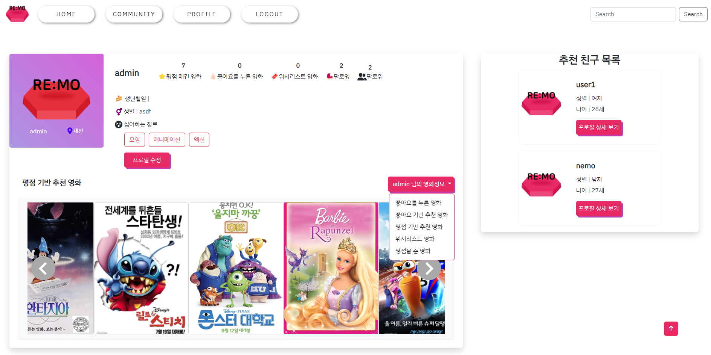
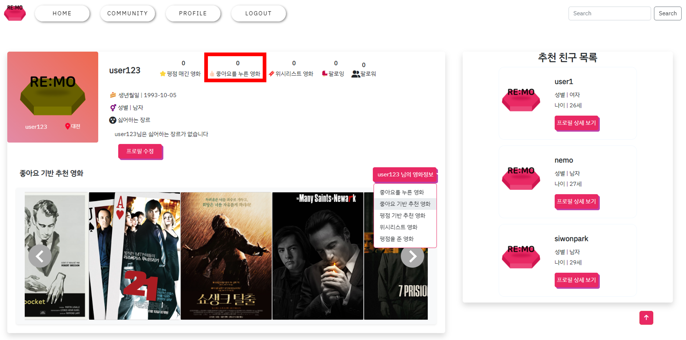
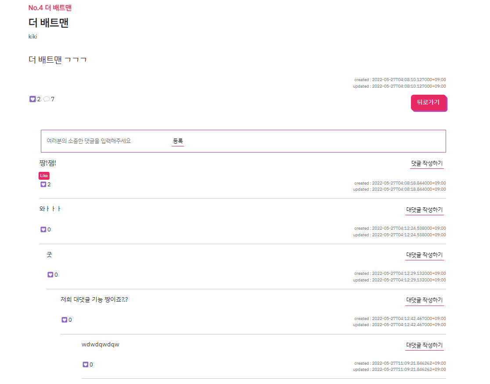

# 상세 화면 구성

 

> ### 메인 페이지

- Vuetify로 메인 화면 구성, 스크롤 이동시 메인 영화 변경

- 다양한 필터링 기능으로 원하는 분류의 영화 필터링

 

 

 

 

 

> ### 상세 페이지

- 평점, 장르, 리뷰글 등 영화의 상세 정보 확인 페이지
- 하단 해당 영화와 비슷한 장르의 영화 3개 랜덤 추천
- 본인이 부여한 평점 수정/삭제 기능 제공

 

 

 

> ### 프로필 페이지

- 유저의 활동 내역과 개인 정보 확인 페이지
- 유사한 나이대, 같은 지역의 영화 친구를 추천받을 수 있는 서비스 제공

 

 

 

> ### 추천 알고리즘

- 콘텐츠 기반 필터링(content based filtering) : 사용자가 특정 아이템을 선호하는 경우 해당 아이템을 추천해주는 방법
- 프로필 페이지에서 유저가 좋아요를 했거나, 평점을 매긴 영화를 기반으로 콘텐츠 기반 필터링을 진행하여 영화를 추천
- 유저의 데이터가 없을 경우, 랜덤으로 영화를 추천

 

 

- 실제 에니메이션 장르 영화를 19개 좋아요 눌렀을 경우, 에니메이션 장르 영화를 추천받음

 

> ### 커뮤니티

- 게시글 목록 및 상세 조회
- 커뮤니티 메인 위치에 유저의 흥미를 이끄는 실시간 투표 및 결과 확인이 가능한 OneVsOne 기능을 구현

 

 

- 대댓글 기능; 컴포넌트(프론트)와 댓글(백엔드) 설계를 재귀 관계로 만들어 대댓글 기능 구현

 

 